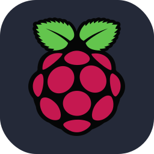

### :smiley: Welcome ! 

- Hiii My name is Gao Yiming. I'm 19 and studying Computer Science in NTU. 

---

  

---

### :man_technologist: About Me : 

- :telescope: I’m a 3rd year Computer Science undergraduate in Nanyang Technological University. 

- :seedling: I'm currently learning DRL & FDD in HVAC system.

- :smiling_face_with_three_hearts: I like guitar, table tennis and strategy games. 

- :zap: In my free time, I try to make some simple offline-games. 

- :mailbox: Email address: GAOY0053@e.ntu.edu.sg

---

### :computer: Project I've Worked on : 

#### NTU Projects: 
[SC1015 - Mini-Project - Analysis of Fright Delay](https://github.com/YichenG170/SC1015_TUTB113_Team11_Mini-Project)

[SC2002 - Group-Project - CAMs System](https://github.com/regan91/SC2002-Group-Project)

#### Projects outside NTU: 
[Wooden-Fish](https://github.com/hellohi-ll/Electronic-MuYu)

[Quiz Simulator](https://github.com/YichenG170/Quiz-Simulator)

---

### :hammer_and_wrench: Languages and Tools : 

  
  
  
  
  
  
  
  
  
  

  
  
  
  
  
  
  
  
  

---

